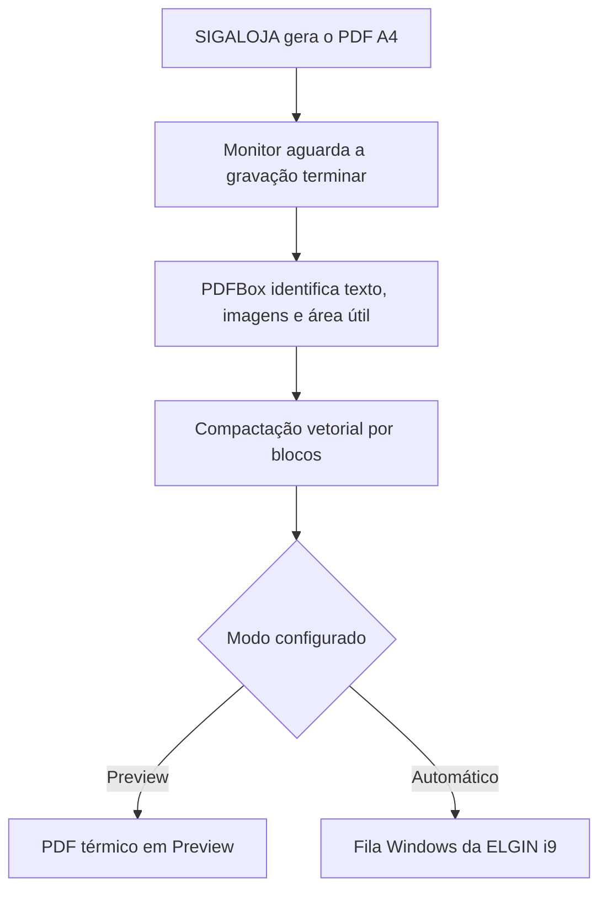

<p align="center">
  
</p>

<h1 align="center">NFC-e Thermal Printer</h1>

<p align="center">
  Aplicação local em Java que converte o PDF A4 de NFC-e gerado pelo
  TOTVS Protheus/SIGALOJA em uma página térmica de largura e altura dinâmicas.
</p>

<p align="center">
  <a href="https://github.com/MatheusFerroTorres/nfce-thermal-printer/actions/workflows/ci.yml"></a>
  
  
  
  
</p>

> Projeto desenvolvido por **Matheus Ferro Torres** para resolver um problema
> real de impressão de NFC-e na AlkhemyLab. A solução foi validada fisicamente
> com uma impressora térmica ELGIN i9 USB e leitura do QR Code por celular.

## O problema

O SIGALOJA produzia um PDF fiscal correto, mas com página semelhante a A4. Ao
enviar esse conteúdo diretamente para uma bobina de 80 mm, o resultado podia
ficar cortado na lateral, reduzido demais ou cercado por grandes áreas em branco.

Reduzir a folha A4 inteira não resolvia: texto e QR Code perdiam tamanho útil.
Reconstruir a NFC-e também não era aceitável, pois criaria risco de divergência
fiscal.

## A solução

O programa trabalha exclusivamente sobre a apresentação do PDF já emitido:



O conteúdo fiscal não é recriado nem reinterpretado. O conversor:

- preserva textos, valores e identificadores existentes;
- reutiliza a imagem original do QR Code, sem OCR;
- reorganiza os blocos dentro da largura imprimível;
- mantém a proporção do QR Code e da logomarca;
- calcula o comprimento da página de acordo com o conteúdo;
- imprime pelo driver do Windows, sem comunicação ESC/POS direta.

## Resultado validado

| Item | Resultado |
|---|---:|
| Página original | 210 × 297 mm |
| Área de conteúdo observada | aproximadamente 178 × 136 mm |
| Bobina física | 80 mm |
| Página lógica entregue ao driver | 72 mm |
| Área útil do leiaute | 68 mm |
| Margem interna | 2 mm por lado |
| Resolução de impressão | 203 dpi |
| QR Code final | 37,537 mm |
| Altura final | dinâmica |
| Impressora validada | ELGIN i9 USB |
| Driver validado | ELGIN Printer Driver 1.7.3 |

Nos testes físicos, a lateral direita deixou de ser cortada e o QR Code
continuou legível. Os 72 mm representam a página lógica aceita pelo driver, não
a largura física da bobina.

## Por que compactação vetorial por blocos?

Três abordagens foram consideradas:

| Abordagem | Vantagem | Risco |
|---|---|---|
| Reduzir a página A4 inteira | implementação simples | texto e QR Code ficam pequenos |
| Rasterizar toda a nota | previsibilidade visual | perde nitidez e aumenta o arquivo |
| Reorganizar blocos vetoriais | preserva texto e aproveita a bobina | exige análise estrutural do PDF |

A terceira abordagem foi escolhida. O pipeline extrai glifos, posições, fontes e
imagens; agrupa o texto em linhas; remove espaçamentos usados apenas para simular
colunas no A4; e recompõe os blocos dentro da área térmica. A rasterização é
usada apenas no envio ao driver quando `print.raster.dpi=203`.

## Principais recursos

- conversão manual de um PDF informado pela linha de comando;
- monitoramento de pasta com `WatchService`;
- detecção combinada da área útil por estrutura e renderização;
- leiaute `enhanced` com logo, divisórias e destaque do total;
- modo `classic` para comparação;
- PDF térmico com altura dinâmica;
- preservação e validação de texto e imagens;
- impressão silenciosa com `PrinterJob` e Java Print Service;
- espera por estabilidade antes de abrir um arquivo novo;
- diário persistente de tentativas com SHA-256;
- reimpressão intencional ilimitada quando o SIGALOJA gerar novamente o PDF;
- bloqueio de reenvio quando o resultado anterior for incerto;
- organização automática de originais, previews, impressos e erros;
- bloqueio de duas instâncias simultâneas;
- inicialização no login pelo Agendador de Tarefas do Windows;
- logs locais rotativos e comando de diagnóstico.

## Arquitetura

| Componente | Responsabilidade |
|---|---|
| `Main` | seleciona conversão manual ou monitor `--watch` |
| `config` | combina valores incorporados ao JAR e configuração externa |
| `pdf` | inspeciona, reorganiza, gera e valida o PDF térmico |
| `print` | localiza a fila exata e envia o trabalho ao spooler |
| `watch.SpoolWatcher` | recebe e coordena eventos do `WatchService` |
| `watch.FileStabilityWaiter` | aguarda o término da gravação |
| `watch.ProcessingJournal` | persiste estados e tentativas |
| `watch.WatchedPdfProcessor` | coordena conversão, impressão e falhas |
| `watch.SpoolLayout` | arquiva arquivos sem sobrescrever históricos |
| `watch.WatcherInstanceLock` | impede monitores concorrentes |
| `scripts` | instala e administra a tarefa do Windows |

### Organização do spool

```text
C:\Spool\
├── Original\
├── Preview\
├── Processado\
├── Impresso\
├── Erro\
├── Duplicado\
└── .nfce-printer\
    ├── initialized
    ├── processing-journal.tsv
    └── watcher.lock
```

| Pasta | Finalidade |
|---|---|
| `Original` | preserva o PDF A4 após uma conclusão segura |
| `Preview` | recebe o PDF térmico quando `auto.print=false` |
| `Processado` | área transitória antes do envio ao spooler |
| `Impresso` | guarda o PDF cujo trabalho foi aceito pelo spooler |
| `Erro` | preserva arquivos que exigem conferência manual |
| `Duplicado` | compatibilidade quando a reimpressão é desativada |
| `.nfce-printer` | estado persistente e lock do monitor |

## Segurança operacional

### Arquivos ainda em gravação

O evento do Windows não garante que o Protheus terminou de escrever o PDF. Por
padrão, o programa exige três verificações consecutivas com mesmo tamanho e data,
separadas por um segundo, além de confirmar que o arquivo é legível e não está
vazio.

### Reimpressões

Com `watch.allow.completed.reprint=true`, cada nova aparição do PDF na raiz do
spool representa uma solicitação independente. A mesma NFC-e pode ser impressa
quantas vezes o usuário solicitar no SIGALOJA.

Eventos `CREATE` e `MODIFY` do mesmo ciclo são agrupados. Uma aparição gera uma
via; uma nova geração do arquivo gera outra via.

### Resultado incerto

Antes de chamar `PrinterJob.print()`, o diário registra `PRINT_SUBMITTING`. Depois
do retorno sem erro, registra `SPOOL_ACCEPTED`. Se o Java ou o Windows for
interrompido nesse intervalo, o programa não consegue afirmar se o papel saiu e
move o documento para `Erro`, evitando uma segunda via automática acidental.

### Primeira execução

O monitor precisa ser inicializado em preview. Com `auto.print=false` e
`watch.initial.scan=true`, os arquivos antigos são classificados e o marcador
`.nfce-printer\initialized` é criado. Só depois disso a impressão automática deve
ser habilitada.

## Requisitos

- Windows 11;
- JDK 17 LTS ou superior;
- Maven 3.9 ou superior para compilar;
- acesso de leitura e escrita ao diretório monitorado;
- PDF textual compatível com o modelo do Protheus Venda Assistida;
- driver e fila da impressora instalados para o mesmo usuário que executa o Java.

O projeto é compilado com `--release 17`, mesmo quando o Maven utiliza JDK 21.

## Começando

### 1. Clonar e compilar

```powershell
git clone https://github.com/MatheusFerroTorres/nfce-thermal-printer.git
cd .\nfce-thermal-printer
mvn clean verify
```

O JAR executável será criado em:

```text
target\nfce-printer.jar
```

### 2. Gerar um preview manual

Mantenha `auto.print=false` em `config\application.properties` e execute:

```powershell
java -jar .\target\nfce-printer.jar "C:\Spool\impressão nfc-e_exemplo.pdf"
```

Será criado `impressão nfc-e_exemplo_termico.pdf` ao lado do original. Nenhum
trabalho de impressão é enviado nesse modo.

### 3. Iniciar o monitor em modo seguro

```powershell
java -jar .\target\nfce-printer.jar --watch
```

O console deve informar `PREVIEW (SEM IMPRESSAO)`. Gere uma NFC-e, abra o PDF em
`C:\Spool\Preview` e valide visualmente o leiaute e o QR Code.

### 4. Habilitar impressão

Depois da validação, altere:

```properties
printer.name=ELGIN i9(USB)
auto.print=true
watch.allow.completed.reprint=true
print.raster.dpi=203
print.copies=1
```

Reinicie o monitor. A configuração é lida somente na inicialização.

## Configuração principal

O arquivo externo `config\application.properties` sobrescreve os valores
incorporados ao JAR.

| Propriedade | Padrão validado | Descrição |
|---|---:|---|
| `spool.directory` | `C:\\Spool` | pasta monitorada |
| `printer.name` | `ELGIN i9(USB)` | nome exato da fila Windows |
| `paper.width.mm` | `72` | largura lógica entregue ao driver |
| `printable.width.mm` | `72` | largura máxima do leiaute |
| `margin.mm` | `2` | margem interna por lado |
| `qr.size.mm` | `37.537` | tamanho final do QR Code |
| `layout.style` | `enhanced` | leiaute aprimorado ou `classic` |
| `logo.enabled` | `true` | exibe a marca no cabeçalho |
| `auto.print` | `false` | preview seguro ou impressão |
| `print.raster.dpi` | `203` | rasterização na resolução da ELGIN |
| `watch.file.glob` | `impressão nfc-e_*.pdf` | filtro de entrada |
| `watch.allow.completed.reprint` | `true` | aceita novas solicitações da mesma nota |

Altere uma única medida por teste. O driver ELGIN 1.7.3 cortou a lateral direita
com uma página lógica de 80 mm; por isso 72 mm é o padrão aprovado.

## Instalação automática no Windows

Após compilar e validar o preview:

```powershell
powershell.exe -NoProfile -ExecutionPolicy Bypass `
    -File .\scripts\instalar-tarefa.ps1
```

O instalador copia a aplicação para:

```text
%LOCALAPPDATA%\AlkhemyLab\NfcePrinter
```

e cria a tarefa `AlkhemyLab NFC-e Printer` no login do usuário. Ela executa
`javaw.exe` em segundo plano e preserva a configuração instalada durante
atualizações normais.

### Consultar, parar e iniciar

```powershell
$Base = "$env:LOCALAPPDATA\AlkhemyLab\NfcePrinter"

powershell.exe -NoProfile -ExecutionPolicy Bypass `
    -File "$Base\scripts\status-tarefa.ps1"

powershell.exe -NoProfile -ExecutionPolicy Bypass `
    -File "$Base\scripts\parar-tarefa.ps1"

powershell.exe -NoProfile -ExecutionPolicy Bypass `
    -File "$Base\scripts\iniciar-tarefa.ps1"
```

## Testes

```powershell
mvn test
```

Os testes cobrem medidas, carregamento da logo, localização de fila, nome do
trabalho, filtro com acentos, estabilidade, lock de instância, diário persistente,
reimpressões sucessivas, estados incertos e proteções dos scripts do Windows.

O workflow de CI executa `mvn verify` em Windows com Eclipse Temurin 17. As versões
das actions seguem a documentação oficial atual: `actions/checkout@v7` e
`actions/setup-java@v5`.

## Estrutura do repositório

```text
nfce-thermal-printer/
├── .github/workflows/ci.yml
├── config/application.properties
├── scripts/
├── src/
│   ├── main/java/br/com/alkhemylab/nfceprinter/
│   ├── main/resources/
│   └── test/java/
├── CHANGELOG.md
├── pom.xml
└── README.md
```

Arquivos fiscais reais, PDFs gerados, logs, JARs, backups e estado do spool são
excluídos pelo `.gitignore`.

## Privacidade

- execução 100% local;
- nenhuma consulta à SEFAZ;
- nenhuma alteração no XML ou no Protheus;
- nenhuma telemetria;
- nenhum conteúdo fiscal enviado para serviços externos;
- logs sem o texto fiscal completo e sem o conteúdo do QR Code.

Nunca anexe uma NFC-e real a uma issue pública. Para reproduzir falhas, utilize um
documento anonimizado ou descreva apenas as dimensões, o estado e a mensagem de
erro.

## Limites conhecidos

- entrada com uma página;
- exatamente um QR Code quadrado e binário;
- PDFs textuais semelhantes ao modelo validado do Protheus Venda Assistida;
- uma pasta monitorada e processamento sequencial;
- confirmação física limitada ao retorno do spooler;
- medidas calibradas na ELGIN i9 com driver 1.7.3.

Novos leiautes do Protheus devem passar novamente por preview, impressão física e
leitura do QR Code.

## Roadmap

- instalador com interface gráfica;
- painel local de saúde e histórico;
- perfis de calibração para outros drivers e bobinas;
- pacote de release automatizado;
- testes com novos modelos de PDF do Protheus.

## Autoria e contexto

Desenvolvido e documentado por
[Matheus Ferro Torres](https://github.com/MatheusFerroTorres), Assistente de TI
na AlkhemyLab.

O repositório pessoal apresenta as decisões de engenharia e o código do projeto.
A documentação operacional oficial é mantida em
[AlkhemyLab/nfce-thermal-printer](https://github.com/AlkhemyLab/nfce-thermal-printer).

## Licenciamento e marcas

Este repositório não concede licença de uso, redistribuição ou comercialização
enquanto não houver um arquivo `LICENSE` aprovado pela AlkhemyLab. A marca
AlkhemyLab e os nomes TOTVS, Protheus, SIGALOJA e ELGIN pertencem aos seus
respectivos titulares.
